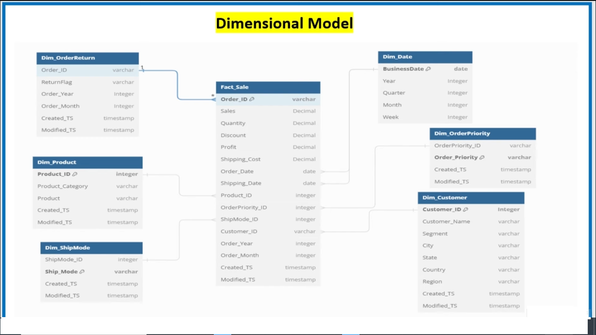

# Microsoft-Fabric-Lakehouse-End-to-End-Project

## Introduction

1. Set up Microsoft Fabric workspace and configure data storage.
2. Ingest raw ecommerce data into the Bronze layer using PySpark.
3. Clean and transform data in the Silver layer using PySpark and SparkSQL.
4. Aggregate and enrich data in the Gold layer using SparkSQL.
5. Create a semantic model to define how data is used for reporting.
6. Build and publish interactive reports and dashboards in Power BI.

## Architecture 

## Components:

1. Microsoft Fabric: Provides the workspace and services for data integration and analysis.
2. PySpark and SparkSQL: Tools for data transformation and processing.
3. Semantic Model: A model for data interpretation and reporting.
4. Power BI: Visualization and reporting tool.

## Run Data Pipeline

## Semantic Model
